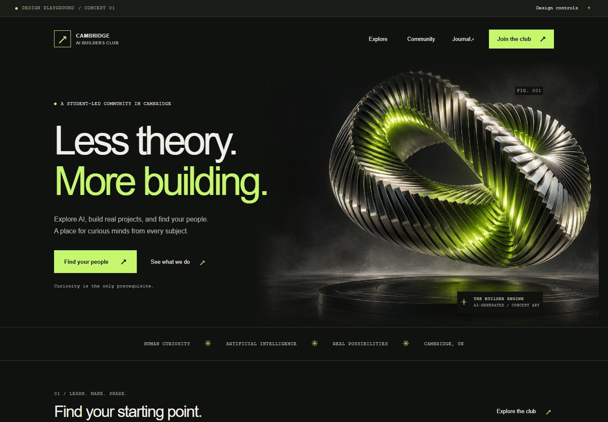
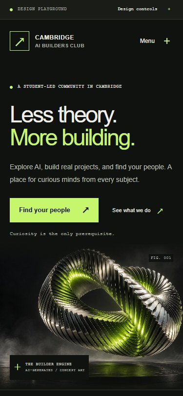

# Design playground verification

Reviewed locally on 6 October 2026, on `codex/design-playground`.

## Build and source integrity

- `npm run build`: passed with Next.js 15.5.27, including TypeScript validation, 24 static pages and 20 legacy redirect stubs.
- The system Node proxy had no active version. Used the already installed Node 24.19.0 runtime without changing global configuration. The PR check uses the repository's Node 20 configuration.
- Added an isolated `/playground/` root layout and CSS. Existing production templates, source collection entries, Sass mirrors and deployment workflows are untouched.
- Playground metadata requests no indexing and the route is absent from the production sitemap.
- Event descriptions, visible member data, signup and Discord links load from the existing root sources.
- Hidden member records remain hidden. No new upcoming events or sponsor claims were introduced.
- `git diff --check`: passed.

## Browser checks

- Fresh screenshot inspection: Home, Explore and Community at 1440px desktop and 375px mobile; mobile navigation and design controls also inspected.
- Document scroll width equals viewport width at 1440px and 375px. Images load successfully.
- Acid, Ice and Ember switches update the accent and artwork tint.
- Pause switches motion off. With the browser's reduced-motion preference enabled, computed hero animation is `none`.
- Explore filtering gives 3 cards, 1 Workshop card, then 3 cards when cleared.
- Returning to Home after filtering still shows all 3 cards. Browser Back restores the Explore view and selected filter.
- Mobile menu opens, closes with Escape, restores focus to its toggle and closes after navigation.
- Review controls close with Escape and restore focus to their toggle.
- All tested internal detail/utility pages, the generated hero asset and a legacy redirect return HTTP 200.
- Browser error log is empty.
- axe-core 4.12.1 found zero automatic WCAG A/AA violations on Home, Explore and the controls panel. It flagged contrast regions over decorative layers for manual review; visual inspection and explicit foreground/background calculations gave contrast ratios above 7:1 for those text pairs. This is a targeted prototype check, not a full accessibility certification.

## Review limitations

- Journal, activity details, About, Contact, committee details and calendar still use the current production design.
- Signup and Discord use the configured external destinations; no form was submitted and no account was joined.
- The dated calendar programme is an archive. Detailed shared event data and future scheduling belong in the migration plan after approval.
- The artwork is generated concept art. Final assets, fonts and mobile crops will be scoped after the direction is approved.
- The local preview server is kept running at `http://localhost:4102/playground/`. No merge or production deploy is authorized at this checkpoint.

## Screenshots

